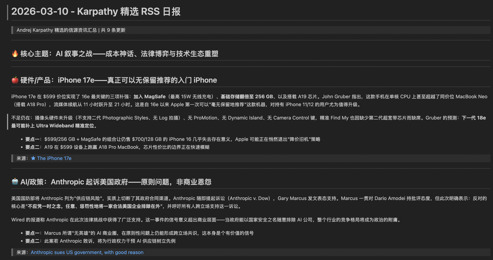
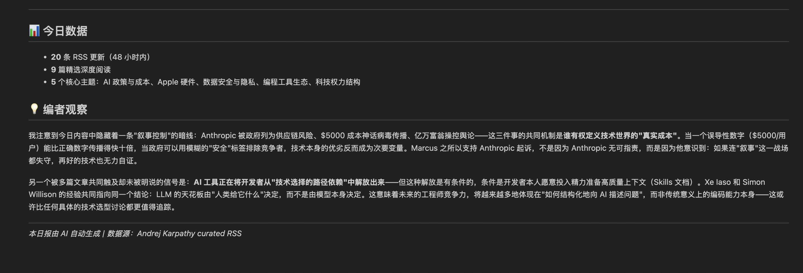

# eric-awesome-skills

**Personal Tech Toolbox** — A curated collection of [Claude Code](https://docs.anthropic.com/en/docs/claude-code/overview) skills for boosting productivity.

Each skill is a self-contained, conversation-triggered workflow that automates complex multi-step tasks. Skills follow the open [SKILL.md standard](https://docs.openclaw.ai/tools/clawhub) — compatible with Claude Code, Codex CLI, Gemini CLI, and OpenClaw.

[English](README.md) | [中文](README.zh-CN.md)

---

## 📦 Skills

| Skill | Description | Triggers | Notes | Preview |
|-------|-------------|----------|-------|-------|
| [karpathy-curated-rss-brief](skills/karpathy-curated-rss-brief/) | Fetches articles from Karpathy's curated 93 RSS feeds and generates a Chinese daily newsletter | `RSS 日报`, `karpathy-curated-rss-brief` | Inspired by [Karpathy's RSS list](https://x.com/karpathy/status/2018043254986703167) & [Cory Doctorow on RSS](https://pluralistic.net/2026/03/07/reader-mode/). Skill page on [YouMind](https://youmind.com/~skills/019c4fce-220b-7f35-974b-0cc543b7682d). See [full inspiration →](skills/karpathy-curated-rss-brief/README.md#inspiration) |   | 

---

## 🚀 Installation

### Option 1 — ClawHub (recommended)

Install directly from the [ClawHub](https://clawhub.ai) registry:

```bash
# Install ClawHub CLI
npm install -g clawhub

# Install the skill
clawhub install karpathy-curated-rss-brief
```

### Option 2 — skills.sh (npx)

```bash
npx skills add https://github.com/MESevenJourney/eric-awesome-skills.git --skill karpathy-curated-rss-brief
```

### Option 3 — Claude Code Plugin Marketplace

Add this repository to the Claude Code plugin marketplace, then browse and install the skill:

```
/plugin marketplace add MESevenJourney/eric-awesome-skills
```

Then open the plugin browser to find and install the skill:

```
/plugin
```

Browse to `karpathy-curated-rss-brief` and select **Install**.

### Dependencies

Some skills use Python scripts and require [`uv`](https://docs.astral.sh/uv/):

```bash
curl -LsSf https://astral.sh/uv/install.sh | sh
```

Scripts use [PEP 723](https://peps.python.org/pep-0723/) inline metadata — dependencies install automatically, no manual `pip install` needed.

---

## 📖 Usage

After installation, trigger a skill by typing its keyword in Claude Code:

```
RSS 日报
```

Claude will automatically run the full workflow: fetch RSS feeds → select articles → read full text → generate a Chinese newsletter and save it locally.


---

## 📜 License

[MIT License](LICENSE)
